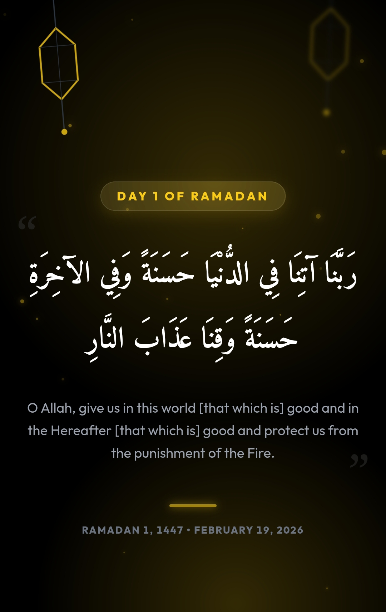

  

   

  

    
    
    
  

  

    <b>A website that brings daily Islamic Duas during the holy month of Ramadan.</b> 
  

  

    
  

---

## 📖 About The Project

**Dua of the Day** is an elegant web application designed to share daily Islamic Duas throughout the blessed month of Ramadan. Featuring a minimalist aesthetic with powerful interactivity, it provides an immersive spiritual experience with ambient effects and customizable themes.

## ✨ Key Features

* **🌙 Daily Duas:** All 30 days of Ramadan Duas with authentic texts.
* **🌍 Instant Bilingual Support:** Seamless toggle between English (LTR) and Arabic (RTL); proper fonts for each language.
* **🎨 Advanced Dynamic Theming:** Easily switch between Light/Dark Mode and four vibrant color palettes, plus a **custom color picker** for unique themes.
* **🧠 Theme Persistence:** All theme and color choices persist automatically using local storage.
* **✨ Zen Mode:** Hide controls with a page click (except buttons), offering a distraction-free spiritual experience.
* **📅 Ramadan Date Tracking:** Automatically tracks current day based on Egyptian time zone; includes a visually interactive "Day Badge" and **time machine roller** for browsing any day.
* **🎭 Ambient Effects:** Animated particles and glowing lanterns create immersive atmosphere matching theme color.
* **🎮 Modern UX Enhancements:** Touch-friendly UI, gentle breathing animation, floating particles, and a responsive design powered by Tailwind CSS.
* **🎊 Eid Celebration:** Special message with festive golden styling after Ramadan concludes.

## 🛠️ Installation & Usage

1.  **No Build Needed:** Built with Vanilla JavaScript & Tailwind CSS (CDN)—just open `index.html` in your browser.
2.  **Live Color Picker:** Easily access a custom color wheel for advanced theme customization.
3.  **Browse Any Dua:** Triple-tap the Day Badge to reveal a scrollable "time machine" for instant access to any day's Dua.
4.  **Persistent UI Preferences:** All user settings (language, theme, color palette) are saved and restored.
5.  **Mobile-first:** Designed for touch, supports native app meta tags for home screen installation.

## 🎮 How to Use

- **Language Toggle:** Click the "AR" or "EN" button in the top-right to switch between Arabic and English.
- **Theme Toggle:** Click the sun/moon icon to switch between light and dark modes.
- **Color Palette:** Click the palette icon to choose from 4 beautiful color themes or use the custom color wheel.
- **Time Machine:** Triple-tap the Day Badge to browse and select any day of Ramadan.
- **Zen Mode:** Click anywhere on the page (except buttons) to hide the control panel.

## 📅 Ramadan Schedule

The website automatically tracks the current date and displays the corresponding Dua for each day of Ramadan. It works based on the Egyptian timezone and updates daily at midnight.

- **Days 1-30:** Display the daily Dua with translation and ambient effects
- **Day 31+:** Show a festive Eid Mubarak message with golden styling

## 🎨 Customization

You can easily customize the application by modifying:

- **Colors:** Edit the `colorThemes` array in the JavaScript or use the custom color wheel to adjust hues.
- **Duas:** Update the `duas` array with different Islamic texts.
- **Fonts:** Change the Google Fonts imports in the `<head>` section.
- **Animations:** Adjust Tailwind animation configurations and keyframes for custom effects.
- **Particles:** Modify the particle system in the `createParticles()` function for different visual effects.

## 📄 License

Distributed under the MIT License. See LICENSE for more information.

---

  Made with ❤️ and Islamic spirit by <strong>Marwan Elmoghazy</strong>

